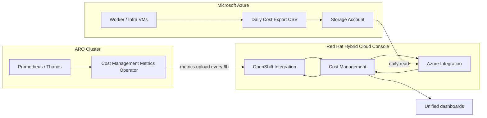

# ARO Cost Management: Metrics Operator + Azure Integration

Complete tutorial for Azure Red Hat OpenShift (ARO) cost visibility in [Red Hat Hybrid Cloud Console](https://console.redhat.com) Cost Management.

## Why you need both integrations

Cost Management on ARO requires **two separate data sources**. Neither alone gives a full picture.

| Integration | What it provides | Where it lives |
|-------------|------------------|----------------|
| **Cost Management Metrics Operator (CMMO)** | OpenShift usage metrics: CPU/memory requests & usage, namespace/project attribution, pod workload data | Installed **on the ARO cluster** |
| **Microsoft Azure cloud integration** | Azure infrastructure billing: VMs, disks, networking, ARO worker/control-plane charges | Configured in **Hybrid Cloud Console** + **Azure Portal/CLI** |

CMMO uploads cluster metrics to `console.redhat.com`. The Azure integration reads daily cost exports from a storage account. Cost Management **correlates** Azure VM instance IDs with OpenShift nodes, then **allocates infrastructure cost to projects** based on usage and requests.



**Without CMMO:** You see Azure infrastructure totals but cannot attribute cost to OpenShift projects/namespaces.

**Without Azure integration:** You see OpenShift usage metrics but no real Azure dollar amounts tied to nodes.

**ARO subscription cost** is included in Azure billing data; Cost Management distributes it to workloads automatically—no manual tracking required.

### Two integrations in Hybrid Cloud Console (don't skip either)

Both steps land in the same place — **Settings → Integrations** — but on **different tabs**. They register two unrelated data pipes:

| | **Red Hat tab** (Part 1) | **Cloud tab** (Part 2) |
|---|---|---|
| **When** | After installing CMMO on the cluster | After Azure cost export + service principal are ready |
| **What you add** | OpenShift / ARO cluster source | Microsoft Azure billing source |
| **Created by** | CMMO auto-creates it (`create_source: true`), or you add manually | You add manually in the wizard |
| **Data direction** | Cluster **pushes** metrics **to** Red Hat | Red Hat **pulls** billing CSV **from** Azure storage |
| **Data type** | Usage ratios — which project consumed how much CPU/memory | Dollar amounts — VM, disk, network, ARO subscription charges |
| **Enables in Cost Management** | **OpenShift** tab, project/namespace breakdown | **Infrastructure** tab, Azure resource costs |
| **Analogy** | Odometer per tenant (who drove how far) | Gas station receipt (what you actually paid) |

Cost Management joins them: it matches Azure VM instance IDs to OpenShift nodes, then splits the Azure bill across projects using CMMO usage data.

```
Part 1 verify → Integrations → Red Hat tab   → "aro-prod-cost" Active
Part 2 verify → Integrations → Cloud tab     → "aro-azure-billing" Active
Both Active   → Cost Management shows $ + project attribution
```

---

## Prerequisites

### Accounts and roles

| Requirement | Details |
|-------------|---------|
| Red Hat account | Access to [console.redhat.com](https://console.redhat.com) |
| Hybrid Cloud Console role | **Cloud Administrator** (or equivalent with `cost-management` write access) |
| ARO cluster | Existing cluster with **cluster-admin** `oc` access |
| Azure subscription | Subscription that hosts the ARO cluster |
| Azure CLI | `az` installed locally or use [Azure Cloud Shell](https://shell.azure.com) |
| OpenShift CLI | `oc` logged in as cluster-admin |

### Gather ARO cluster identifiers

```bash
# Log in to your ARO cluster
oc login https://api.<cluster>.<region>.aroapp.io:6443

# Cluster ID — needed for manual OpenShift integration
oc get clusterversion version -o jsonpath='{.spec.clusterID}{"\n"}'

# Resource group and subscription (Azure side)
az login
az account set --subscription "<YOUR_SUBSCRIPTION_ID>"
az aro list -o table
# Note: resourceGroup, location, name
```

### Scope: one resource group

This guide scopes everything to **one Azure resource group** — the RG that contains your ARO cluster (`$ARO_RG`). That RG holds the cluster, the cost-export storage account, and the daily billing export. You only see costs for that cluster, not the rest of the subscription.

Set shell variables used throughout this guide:

```bash
export SUBSCRIPTION_ID="<your-azure-subscription-id>"
export TENANT_ID="$(az account show --query tenantId -o tsv)"
export ARO_RG="<aro-cluster-resource-group>"           # e.g. rg-aro-prod — cluster + storage + export
export CM_STORAGE="costmgmt$(openssl rand -hex 4)"     # globally unique, lowercase
export CM_EXPORT_NAME="rh-cost-export-daily"
export RH_OCP_SOURCE_NAME="aro-prod-cost-nd"              # OpenShift integration name
export RH_AZ_SOURCE_NAME="aro-azure-billing"           # Azure integration name
export CM_SP_NAME="sp-rh-cost-management"
export EXPORT_SCOPE="/subscriptions/${SUBSCRIPTION_ID}/resourceGroups/${ARO_RG}"
```

Confirm the RG exists and contains your cluster:

```bash
az group show -n "$ARO_RG" -o table
az aro list -g "$ARO_RG" -o table
```

---

## Part 1 — Cost Management Metrics Operator (cluster side)

Install CMMO and connect the cluster to Hybrid Cloud Console. Choose **Console** or **CLI**; both produce the same result.

### Option A: OpenShift Console (recommended for first setup)

1. Log in to the ARO web console as cluster-admin.
2. Navigate to **Operators → OperatorHub** (OCP 4.18 and earlier) or **Operators → Software Catalog** (4.19+).
3. Search for **Cost Management Metrics Operator**.
4. Click **Install**:
   - **Installation mode:** A specific namespace on the cluster
   - **Namespace:** `costmanagement-metrics-operator` (create if prompted)
   - **Update approval:** Automatic (or Manual per policy)
5. Click **Install** and wait until status is **Succeeded** under **Operators → Installed Operators**.

#### Create CostManagementMetricsConfig

1. On the installed operator page, click **Create CostManagementMetricsConfig**.
2. Switch to **YAML** view and apply:

```yaml
apiVersion: costmanagement-metrics-cfg.openshift.io/v1beta1
kind: CostManagementMetricsConfig
metadata:
  name: costmanagementmetricscfg
  namespace: costmanagement-metrics-operator
spec:
  authentication:
    type: token
  packaging:
    max_reports_to_store: 30
    max_size_MB: 100
  prometheus_config:
    collect_previous_data: true
    context_timeout: 120
    disable_metrics_collection_cost_management: false
    disable_metrics_collection_resource_optimization: false
  source:
    check_cycle: 1440
    create_source: true
    name: aro-prod-cost
  upload:
    upload_cycle: 360
    upload_toggle: true
```

3. Click **Create**.

| Field | Purpose |
|-------|---------|
| `authentication.type: token` | Default; uses cluster token auth to Hybrid Cloud Console |
| `source.create_source: true` | Auto-creates OpenShift integration in Hybrid Cloud Console |
| `source.name` | Integration name visible under **Settings → Integrations → Red Hat** |
| `upload.upload_cycle: 360` | Generate/upload reports every 360 minutes (6 hours) |

> If you **already created** an OpenShift integration manually in Hybrid Cloud Console, set `create_source: false` and ensure the integration's cluster ID matches your cluster.

> If you see **“duplicate accounts / integration already exists”**, CMMO or a prior attempt already created the source — use the existing Red Hat tab entry; do not add another. See troubleshooting section.

#### Service account auth (optional, preferred for production)

Basic auth is deprecated. For long-lived clusters, use a Hybrid Cloud Console service account:

1. **Hybrid Cloud Console** → **Settings** → **Identity & Access Management** → **Service Accounts** → **Create service account**.
2. Add the service account to a group with **Cloud Administrator** role (**Settings → User Access → Groups**).
3. Save `client_id` and `client_secret` (shown once).

Create the secret on the cluster:

```bash
oc create namespace costmanagement-metrics-operator --dry-run=client -o yaml | oc apply -f -

cat <<EOF | oc apply -f -
apiVersion: v1
kind: Secret
metadata:
  name: service-account-auth-secret
  namespace: costmanagement-metrics-operator
type: Opaque
stringData:
  client_id: "<CLIENT_ID>"
  client_secret: "<CLIENT_SECRET>"
EOF
```

Update `CostManagementMetricsConfig`:

```yaml
spec:
  authentication:
    type: service-account
    secret_name: service-account-auth-secret
  source:
    create_source: true
    name: aro-prod-cost
```

### Option B: OpenShift CLI (GitOps-friendly)

```bash
# Verify operator is available
oc describe packagemanifest costmanagement-metrics-operator -n openshift-marketplace | grep -E "Channels|Package"

# OperatorGroup
cat <<EOF | oc apply -f -
apiVersion: operators.coreos.com/v1
kind: OperatorGroup
metadata:
  name: costmanagement-metrics-operator
  namespace: costmanagement-metrics-operator
spec:
  targetNamespaces:
    - costmanagement-metrics-operator
EOF

# Subscription
cat <<EOF | oc apply -f -
apiVersion: operators.coreos.com/v1alpha1
kind: Subscription
metadata:
  name: costmanagement-metrics-operator
  namespace: costmanagement-metrics-operator
spec:
  channel: stable
  installPlanApproval: Automatic
  name: costmanagement-metrics-operator
  source: redhat-operators
  sourceNamespace: openshift-marketplace
EOF

# Wait for CSV
oc get csv -n costmanagement-metrics-operator -w
```

Apply the `CostManagementMetricsConfig` from Option A (save as `costmanagementmetricscfg.yaml`):

```bash
oc apply -f costmanagementmetricscfg.yaml
```

### Option C: Manual OpenShift integration (no auto-create)

Use when `create_source: false` or for restricted-network clusters.

1. **Hybrid Cloud Console** → **Settings** → **Integrations** → **Red Hat** tab → **Add integration**.
2. Type: **Red Hat OpenShift Container Platform** → Application: **Cost Management**.
3. Integration name: `aro-prod-cost`.
4. Cluster identifier: paste output of `oc get clusterversion version -o jsonpath='{.spec.clusterID}'`.
5. Click **Add**.

### Verify CMMO (cluster side)

```bash
# Operator installed
oc get csv -n costmanagement-metrics-operator

# Config status — look for prometheus_connected and upload fields
oc get costmanagementmetricsconfig -n costmanagement-metrics-operator -o yaml | \
  grep -E "prometheus_connected|last_successful_upload|last_upload_status|create_source"

# Operator pod healthy
oc get pods -n costmanagement-metrics-operator

# Recent operator logs
oc logs -n costmanagement-metrics-operator -l app=costmanagement-metrics-operator --tail=50
```

Expected in `CostManagementMetricsConfig` status:

```yaml
prometheus:
  prometheus_configured: true
  prometheus_connected: true
upload:
  last_upload_status: "202 Accepted"
  last_successful_upload_time: "<recent timestamp>"
```

**Hybrid Cloud Console check (Integration #1 of 2 — OpenShift / Red Hat tab):**

This confirms the **cluster → Red Hat** link is working. CMMO created this when `create_source: true`; it is **not** the Azure billing integration.

1. Go to [console.redhat.com](https://console.redhat.com) → **Settings** → **Integrations** → **Red Hat** tab.
2. Confirm integration `aro-prod-cost` (or your `source.name`) shows **Active**.
3. You should **not** see Azure storage or subscription fields here — only cluster identity.

> Next: Part 2 adds a **separate** integration on the **Cloud** tab for Azure billing. You need both tabs showing Active.

### ARO note: Cost Management integration vs OCM cluster registration

These are **two different things** in Hybrid Cloud Console:

| | **Cost Management integration** (Red Hat tab) | **OCM cluster registration** (`/openshift`) |
|---|---|---|
| **Purpose** | Feed usage metrics into Cost Management | Show cluster in OpenShift listing, support, telemetry |
| **Required for cost data?** | **Yes** | No (not a substitute) |
| **How** | CMMO `create_source: true` or manual Option C | Merge `cloud.openshift.com` pull secret into ARO cluster |
| **Where to check** | Settings → Integrations → **Red Hat** tab | [console.redhat.com/openshift](https://console.redhat.com/openshift) |

ARO clusters are **not** auto-registered to OCM. That does **not** block Cost Management if CMMO is installed and uploading. However, if the Red Hat tab shows **no data found**, fix the Cost Management integration first (below) — do not assume registering at `/openshift` alone will fix it.

---

## Part 2 — Microsoft Azure cloud integration (billing side)

Configure Azure to export daily billing CSV from `$ARO_RG` into a storage account in the **same resource group**, then register that source in Hybrid Cloud Console.

### Step 1: Create storage account in the ARO resource group (Azure CLI)

Storage lives in `$ARO_RG` alongside the cluster — no second resource group.

```bash
# Use the same region as your ARO cluster
ARO_LOCATION=$(az group show -n "$ARO_RG" --query location -o tsv)

az storage account create \
  --name "$CM_STORAGE" \
  --resource-group "$ARO_RG" \
  --location "$ARO_LOCATION" \
  --sku Standard_LRS \
  --kind StorageV2 \
  --min-tls-version TLS1_2

# Confirm
az storage account show -n "$CM_STORAGE" -g "$ARO_RG" -o table
```

### Step 2: Create service principal for Red Hat access

Red Hat needs **Storage Blob Data Reader** and **Cost Management Reader** on `$ARO_RG`.

```bash
SP_JSON=$(az ad sp create-for-rbac \
  --name "$CM_SP_NAME" \
  --role "Storage Blob Data Reader" \
  --scopes "$EXPORT_SCOPE" \
  --json-auth)

export AZ_CLIENT_ID=$(echo "$SP_JSON" | jq -r .clientId)
export AZ_CLIENT_SECRET=$(echo "$SP_JSON" | jq -r .clientSecret)
# TENANT_ID already set above

echo "Client ID:     $AZ_CLIENT_ID"
echo "Client Secret: $AZ_CLIENT_SECRET"
echo "Tenant ID:     $TENANT_ID"
# Store the secret securely — it is not retrievable later

# Cost Management Reader on the same resource group (export scope)
az role assignment create \
  --assignee "$AZ_CLIENT_ID" \
  --role "Cost Management Reader" \
  --scope "$EXPORT_SCOPE"

# Verify both roles
az role assignment list --assignee "$AZ_CLIENT_ID" --scope "$EXPORT_SCOPE" -o table
```

### Step 3: Configure daily cost export

#### Option A: Azure Portal

1. Azure Portal → search **Cost Management + Billing** → **Cost Management** → **Cost export**.
2. Click **+ Add** → **Daily export**.
3. Configure:
   - **Export name:** `rh-cost-export-daily`
   - **Scope:** Resource group → select `$ARO_RG`
   - **Storage account:** `$CM_STORAGE` in resource group `$ARO_RG`
   - **Container:** create `costexport` (or accept default)
   - **Directory:** `daily` (optional)
   - **Format:** CSV
   - **Compression:** Gzip or None
   - **Overwrite data:** No (append daily files)
4. Click **Create**. First export may take up to 24 hours.

#### Option B: Azure CLI

Requires Azure CLI **2.55+** and the `costmanagement` extension. Storage destination uses `--storage-account-id`, `--storage-container`, and `--storage-directory` directly — there is no `--delivery-info` or `--format` flag.

```bash
# Install extension (first time only)
az extension add --name costmanagement

# Create container
az storage container create \
  --account-name "$CM_STORAGE" \
  --name costexport \
  --auth-mode login

STORAGE_ACCOUNT_ID="/subscriptions/${SUBSCRIPTION_ID}/resourceGroups/${ARO_RG}/providers/Microsoft.Storage/storageAccounts/${CM_STORAGE}"

# Recurrence start must be today or future (Azure CLI requirement)
EXPORT_FROM=$(date -u -v+1d +%Y-%m-%dT00:00:00Z 2>/dev/null || date -u -d '+1 day' +%Y-%m-%dT00:00:00Z)
EXPORT_TO=$(date -u -v+2y +%Y-%m-%dT00:00:00Z 2>/dev/null || date -u -d '+2 years' +%Y-%m-%dT00:00:00Z)

# Daily actual-cost export scoped to the ARO resource group
az costmanagement export create \
  --name "$CM_EXPORT_NAME" \
  --scope "$EXPORT_SCOPE" \
  --type ActualCost \
  --timeframe MonthToDate \
  --storage-account-id "$STORAGE_ACCOUNT_ID" \
  --storage-container costexport \
  --storage-directory daily \
  --recurrence Daily \
  --recurrence-period from="$EXPORT_FROM" to="$EXPORT_TO" \
  --schedule-status Active
```

> **Portal vs CLI:** If Red Hat Cost Management rejects the export schema, create the export via **Option A (Portal)** using template **Cost and usage details (actual)** → **Daily export of month-to-date costs**. That matches what Red Hat expects for unfiltered integrations.

Verify export exists:

```bash
az costmanagement export list --scope "$EXPORT_SCOPE" -o table
```

Wait for first blob (can take up to 24h after creation):

`--auth-mode login` requires **Storage Blob Data Reader** on the storage account for your user. Subscription Owner/Contributor alone is not enough.

```bash
# One-time: grant your signed-in user blob read on the storage account
USER_ID=$(az ad signed-in-user show --query id -o tsv)
az role assignment create \
  --assignee "$USER_ID" \
  --role "Storage Blob Data Reader" \
  --scope "$STORAGE_ACCOUNT_ID"

# Then list blobs (allow ~1 min for RBAC propagation)
az storage blob list \
  --account-name "$CM_STORAGE" \
  --container-name costexport \
  --auth-mode login \
  -o table
```

**Quick fallback** using the account key (no extra RBAC needed if you can read keys):

```bash
az storage blob list \
  --account-name "$CM_STORAGE" \
  --container-name costexport \
  --auth-mode key \
  --account-key "$(az storage account keys list -g "$ARO_RG" -n "$CM_STORAGE" --query '[0].value' -o tsv)" \
  -o table
```

### Step 4: Get cost export scope string

Hybrid Cloud Console needs the export scope identifier.

**Portal:** Cost export → open your export → copy **Scope** from the overview blade.

**CLI:**

```bash
az costmanagement export show \
  --name "$CM_EXPORT_NAME" \
  --scope "$EXPORT_SCOPE" \
  --query "{name:name, scope:scope}" -o json
```

Expected scope value: `/subscriptions/<sub-id>/resourceGroups/<aro-rg>`.

### Step 5: Add Azure integration in Hybrid Cloud Console (Integration #2 of 2 — Cloud tab)

This is the **billing side**. It tells Red Hat where to read Azure cost CSV files from your storage account. It does **not** connect to your OpenShift cluster directly — that was Part 1 (Red Hat tab).

| Part 1 (done) | Part 2 (this step) |
|---------------|-------------------|
| Red Hat tab → OpenShift cluster | Cloud tab → Microsoft Azure |
| CMMO pushes usage metrics | Red Hat pulls daily cost export |
| Answers: *who used what?* | Answers: *what did Azure charge?* |

1. Open [console.redhat.com](https://console.redhat.com) → **Settings** → **Integrations**.
2. **Cloud** tab (not Red Hat) → **Add integration**.
3. Walk through the wizard:

| Step | Value |
|------|-------|
| Cloud provider | Microsoft Azure |
| Integration name | `aro-azure-billing` |
| Application | Cost Management |
| Cost export scope | **I am OK with sending the default data to Cost Management** (unfiltered) |
| Scope level | **Resource group** |
| Resource group name | `$ARO_RG` (same RG as cluster and storage) |
| Storage account name | `$CM_STORAGE` |
| Cost export name | `rh-cost-export-daily` |
| Subscription ID | `$SUBSCRIPTION_ID` |
| Tenant ID | `$TENANT_ID` |
| Client ID | `$AZ_CLIENT_ID` |
| Client Secret | `$AZ_CLIENT_SECRET` |

4. Review → **Add**.
5. Confirm integration status is **Active** on the **Cloud** tab (may show **Initial setup** until first export is ingested).

**Hybrid Cloud Console check (Integration #2 of 2 — Cloud tab):**

1. **Settings** → **Integrations** → **Cloud** tab.
2. Confirm `aro-azure-billing` (or your name) shows **Active**.
3. This entry references storage account, subscription ID, and service principal — not cluster ID.

**Both integrations should now be Active:**

| Tab | Integration | Status |
|-----|-------------|--------|
| Red Hat | `aro-prod-cost` (from Part 1 / CMMO) | Active |
| Cloud | `aro-azure-billing` (from this step) | Active |

> **Do not** create both filtered and unfiltered Azure integrations. Use unfiltered unless you have a specific data-sharing requirement.

---

## Part 3 — Validate end-to-end

Allow **up to 24 hours** after both integrations are active for dashboards to populate.

### Hybrid Cloud Console

1. **All services** → **Subscriptions and Spend** → **OpenShift** → **Cost Management**.
2. Check tabs:
   - **Overview** — blended cost trend
   - **OpenShift** — project/namespace cost (requires CMMO)
   - **Infrastructure** — Azure VM/disk/network costs (requires Azure integration)
3. Use **Perspective** dropdown to switch between OpenShift and Infrastructure views.
4. Filter by cluster name, Azure resource group, or tags.

### Cluster-side recheck

```bash
# CMMO still uploading
oc get costmanagementmetricsconfig costmanagementmetricscfg \
  -n costmanagement-metrics-operator \
  -o jsonpath='{.status.upload}{"\n"}' | jq .

# Integration exists in RH console (manual check)
# Settings → Integrations → Red Hat + Cloud tabs both Active
```

### Azure-side recheck

```bash
# Export ran and wrote files (use key auth if login lacks Blob Data Reader)
az storage blob list \
  --account-name "$CM_STORAGE" \
  --container-name costexport \
  --prefix daily/ \
  --auth-mode key \
  --account-key "$(az storage account keys list -g "$ARO_RG" -n "$CM_STORAGE" --query '[0].value' -o tsv)" \
  --query "[].{name:name, lastModified:properties.lastModified}" \
  -o table

# Service principal roles
az role assignment list --assignee "$AZ_CLIENT_ID" -o table
```

### What “good” looks like

| Signal | CMMO | Azure integration |
|--------|------|-------------------|
| Integration status | Active under Red Hat tab | Active under Cloud tab |
| Data in Cost Management | OpenShift tab shows projects/namespaces | Infrastructure tab shows Azure resources |
| ARO worker costs | Node names map to Azure VMs | VM costs appear under Infrastructure |
| Project allocation | Costs distributed by CPU/mem usage | Requires both sources |

---

## Troubleshooting

### CMMO: `prometheus_connected: false`

```bash
oc get costmanagementmetricsconfig -n costmanagement-metrics-operator -o yaml
oc logs -n costmanagement-metrics-operator -l app=costmanagement-metrics-operator
```

- Confirm Thanos querier is reachable: `https://thanos-querier.openshift-monitoring.svc:9091`
- On large clusters, increase operator memory via Subscription `config.resources.limits.memory: 2Gi`

### CMMO: upload failures (`last_upload_status` not 202)

- Cluster egress to `console.redhat.com` must be allowed (443).
- For proxy-only egress, configure CMMO-specific proxy per [OpenShift proxy docs](https://docs.redhat.com/en/documentation/openshift_container_platform/latest/html/operators/administrator-tasks#olm-configuring-proxy-support).
- Verify service account is in a group with Cloud Administrator role.

### Azure storage: blob list permission denied

`--auth-mode login` uses your Azure AD identity and requires a **data-plane** role on the storage account:

```bash
USER_ID=$(az ad signed-in-user show --query id -o tsv)
az role assignment create \
  --assignee "$USER_ID" \
  --role "Storage Blob Data Reader" \
  --scope "/subscriptions/${SUBSCRIPTION_ID}/resourceGroups/${ARO_RG}/providers/Microsoft.Storage/storageAccounts/${CM_STORAGE}"
```

Or use the account key:

```bash
az storage blob list \
  --account-name "$CM_STORAGE" \
  --container-name costexport \
  --auth-mode key \
  --account-key "$(az storage account keys list -g "$ARO_RG" -n "$CM_STORAGE" --query '[0].value' -o tsv)" \
  -o table
```

> The Red Hat service principal already has **Storage Blob Data Reader** — this error only affects your CLI verification, not Cost Management ingestion.

### Azure integration: “Still processing data” after 24h

```bash
# Export exists and has recent blobs
az costmanagement export show --name "$CM_EXPORT_NAME" --scope "$EXPORT_SCOPE"

az storage blob list --account-name "$CM_STORAGE" --container-name costexport \
  --auth-mode key \
  --account-key "$(az storage account keys list -g "$ARO_RG" -n "$CM_STORAGE" --query '[0].value' -o tsv)"

# Role assignments present
az role assignment list --assignee "$AZ_CLIENT_ID" -o table
```

- Confirm storage account and resource group names match the wizard exactly.
- Regenerate client secret if expired: `az ad sp credential reset --id "$AZ_CLIENT_ID"`.
- Cost export scope in the wizard must match the export you created in Azure.

### OpenShift costs show but Infrastructure is empty

Azure integration missing or export not running. Complete Part 2.

### Infrastructure costs show but OpenShift tab is empty

CMMO not installed or not uploading. Complete Part 1 and verify `last_successful_upload_time`.

### Red Hat tab: integration error / “no data found”

The Red Hat tab entry **is** the cluster registration for Cost Management. You need it — but “no data found” usually means the integration **exists** while CMMO has **not delivered metrics yet** (or upload is failing).

**Step 1 — Confirm cluster ID matches integration**

```bash
# Your cluster's ID
oc get clusterversion version -o jsonpath='{.spec.clusterID}{"\n"}'
```

In Hybrid Cloud Console → **Settings** → **Integrations** → **Red Hat** tab → open the integration → **Cluster identifier** must match **exactly**.

**Step 2 — Check CMMO is uploading**

```bash
oc get csv -n costmanagement-metrics-operator
oc get costmanagementmetricsconfig -n costmanagement-metrics-operator -o yaml | \
  grep -E "last_upload_status|last_successful_upload|prometheus_connected|source"
oc logs -n costmanagement-metrics-operator -l app=costmanagement-metrics-operator --tail=100
```

| Status field | Good | Problem |
|--------------|------|---------|
| `prometheus_connected` | `true` | CMMO can't reach Prometheus |
| `last_upload_status` | `202 Accepted` | Auth or egress failure |
| `last_successful_upload_time` | recent timestamp | No data uploaded yet — wait up to **6 hours** (`upload_cycle: 360`) |

**Step 3 — Fix missing or broken integration**

If **no row** on Red Hat tab, or auto-create failed:

1. Set `create_source: true` in `CostManagementMetricsConfig` and re-apply, **or**
2. Create manually (Option C): **Add integration** → Red Hat OpenShift Container Platform → Cost Management → paste cluster ID from Step 1.

If upload keeps failing on ARO, switch to **service-account auth** (Part 1) — token auth can be unreliable without OCM pull-secret connectivity.

**Step 4 — Optional: register ARO to OCM** (support/telemetry, not a Cost Management fix)

Only if you also want the cluster at [console.redhat.com/openshift](https://console.redhat.com/openshift):

1. Download pull secret from [console.redhat.com/openshift/downloads](https://console.redhat.com/openshift/downloads).
2. Merge `cloud.openshift.com` entry into ARO pull secret per [ARO pull secret docs](https://cloud.redhat.com/experts/aro/ocm/).
3. Wait up to 24h for cluster to appear in OCM.

This is **orthogonal** to Cost Management — do Step 1–3 first.

### “Duplicate accounts” / integration already exists

```
Cost management does not allow duplicate accounts.
An integration already exists with these details.
```

**Do not create a new integration.** One source per cluster ID (Red Hat tab) or per Azure storage account (Cloud tab).

#### Red Hat tab (OpenShift) — most common on ARO

CMMO with `create_source: true` already registered your cluster. Creating a manual integration with the same cluster ID triggers this error.

**Fix — use the existing integration:**

1. **Settings** → **Integrations** → **Red Hat** tab.
2. Find the existing row (may use cluster ID as name, not `aro-prod-cost`).
3. Confirm **Cluster identifier** matches:

```bash
oc get clusterversion version -o jsonpath='{.spec.clusterID}{"\n"}'
```

4. On the cluster, set `create_source: false` so CMMO stops trying to re-create it:

```bash
oc patch costmanagementmetricsconfig costmanagementmetricscfg \
  -n costmanagement-metrics-operator --type merge -p \
  '{"spec":{"source":{"create_source":false,"name":"<existing-integration-name>"}}}'
```

Replace `<existing-integration-name>` with the name shown in Hybrid Cloud Console.

5. Verify CMMO uploads to the **existing** source:

```bash
oc get costmanagementmetricsconfig -n costmanagement-metrics-operator -o yaml | \
  grep -E "last_upload_status|last_successful_upload"
```

**If the existing integration is wrong** (wrong cluster ID, stale test entry):

1. Red Hat tab → **⋮** → **Remove** the bad integration.
2. Wait a few minutes.
3. Either re-apply CMMO with `create_source: true`, or create manually (Option C) once.

#### Cloud tab (Azure)

Same error if Azure integration already exists for that subscription + storage account + export name.

1. **Settings** → **Integrations** → **Cloud** tab — use or edit the existing Azure row.
2. Only remove and re-add if credentials or export name changed.

### Duplicate integrations

- **Red Hat tab:** one OpenShift source per cluster ID.
- **Cloud tab:** one Azure source per storage account/export pair.
- Remove duplicates under **Settings → Integrations → ⋮ → Remove**.

---

## Optional: large cluster tuning

Increase CMMO resources if the operator OOMs during initial Prometheus scrape:

```bash
oc patch subscription costmanagement-metrics-operator \
  -n costmanagement-metrics-operator \
  --type merge -p '{
    "spec": {
      "config": {
        "resources": {
          "limits": {"cpu": "500m", "memory": "2Gi"},
          "requests": {"cpu": "200m", "memory": "512Mi"}
        }
      }
    }
  }'
```

Reduce after initial ingestion completes if desired.

---

## Quick reference — full CLI bootstrap

Replace placeholders, then run in order:

```bash
# --- Variables (one resource group) ---
export SUBSCRIPTION_ID="<sub-id>"
export TENANT_ID="$(az account show --query tenantId -o tsv)"
export ARO_RG="<aro-rg>"                                # cluster + storage + export scope
export CM_STORAGE="costmgmt<unique>"
export CM_EXPORT_NAME="rh-cost-export-daily"
export CM_SP_NAME="sp-rh-cost-management"
export EXPORT_SCOPE="/subscriptions/${SUBSCRIPTION_ID}/resourceGroups/${ARO_RG}"
ARO_LOCATION=$(az group show -n "$ARO_RG" --query location -o tsv)
STORAGE_ACCOUNT_ID="/subscriptions/${SUBSCRIPTION_ID}/resourceGroups/${ARO_RG}/providers/Microsoft.Storage/storageAccounts/${CM_STORAGE}"

# --- Azure: storage in ARO RG ---
az storage account create -n "$CM_STORAGE" -g "$ARO_RG" -l "$ARO_LOCATION" --sku Standard_LRS --kind StorageV2
az storage container create --account-name "$CM_STORAGE" -n costexport --auth-mode login

# --- Azure: SP + roles (both on ARO_RG) ---
SP_JSON=$(az ad sp create-for-rbac --name "$CM_SP_NAME" \
  --role "Storage Blob Data Reader" --scopes "$EXPORT_SCOPE" --json-auth)
export AZ_CLIENT_ID=$(echo "$SP_JSON" | jq -r .clientId)
export AZ_CLIENT_SECRET=$(echo "$SP_JSON" | jq -r .clientSecret)
az role assignment create --assignee "$AZ_CLIENT_ID" --role "Cost Management Reader" --scope "$EXPORT_SCOPE"

# --- Azure: daily export (resource group scope) ---
az extension add --name costmanagement 2>/dev/null || true
EXPORT_FROM=$(date -u -v+1d +%Y-%m-%dT00:00:00Z 2>/dev/null || date -u -d '+1 day' +%Y-%m-%dT00:00:00Z)
EXPORT_TO=$(date -u -v+2y +%Y-%m-%dT00:00:00Z 2>/dev/null || date -u -d '+2 years' +%Y-%m-%dT00:00:00Z)
az costmanagement export create \
  --name "$CM_EXPORT_NAME" \
  --scope "$EXPORT_SCOPE" \
  --type ActualCost \
  --timeframe MonthToDate \
  --storage-account-id "$STORAGE_ACCOUNT_ID" \
  --storage-container costexport \
  --storage-directory daily \
  --recurrence Daily \
  --recurrence-period from="$EXPORT_FROM" to="$EXPORT_TO" \
  --schedule-status Active

# --- ARO: install CMMO (after oc login) ---
# Apply OperatorGroup, Subscription, CostManagementMetricsConfig from Part 1

# --- Hybrid Cloud Console ---
# Add Azure integration manually with values above (Part 2, Step 5)
# OpenShift integration auto-created if create_source: true
```

---

## References

- [Red Hat learning path: ARO cost management](https://docs.redhat.com/en/learn/learning-paths/cost-management-azure-red-hat-openshift/)
- [Integrating OpenShift data into Cost Management](https://docs.redhat.com/en/documentation/cost_management_service/1-latest/html-single/integrating_openshift_container_platform_data_into_cost_management/index)
- [Integrating Microsoft Azure data into Cost Management](https://docs.redhat.com/en/documentation/cost_management_service/1-latest/html-single/integrating_microsoft_azure_data_into_cost_management/index)
- [Track OpenShift costs on Azure (Red Hat blog)](https://www.redhat.com/en/blog/track-your-openshift-costs-more-easily-azure-new-and-improved-capabilities-red-hat-cost-management)
- [Microsoft: Create a cost export](https://learn.microsoft.com/en-us/azure/cost-management-billing/costs/tutorial-export-acm-data)
